📦 Full Repository Build — GitDigital-ZK/Civilisation

Author: Rickcreator1987 · Ecosystem: GitDigital Products

Below is every file needed. Copy each block into the matching path, then commit in the order shown at the end.

---

📁 Final Tree

```
Civilisation/
├── .github/
│   ├── workflows/
│   │   ├── ci.yml
│   │   └── release.yml
│   ├── ISSUE_TEMPLATE/
│   │   ├── bug_report.yml
│   │   ├── feature_request.yml
│   │   └── config.yml
│   ├── PULL_REQUEST_TEMPLATE.md
│   └── FUNDING.yml
├── docs/
│   ├── ARCHITECTURE.md
│   ├── WHITEPAPER.md
│   ├── INTEGRATION_GUIDE.md
│   ├── ROADMAP.md
│   └── DIAGRAMS.md
├── src/
│   ├── zk/.gitkeep
│   ├── solana/.gitkeep
│   └── sdk/
│       ├── index.ts
│       └── package.json
├── tests/.gitkeep
├── scripts/
│   └── bootstrap.sh
├── .gitignore
├── .editorconfig
├── CHANGELOG.md
├── CODE_OF_CONDUCT.md
├── CONTRIBUTING.md
├── LICENSE
├── SECURITY.md
├── package.json
├── pnpm-workspace.yaml
├── tsconfig.json
└── README.md
```

---

1. README.md


# Civilisation
### GitDigital Products — Civilisation


A foundational framework for decentralized, privacy-preserving digital civilisation infrastructure — built on cryptographic trust, zero-knowledge compliance, and user-sovereign identity.

---

## 🏷️ Tags & Topics

`#ZeroKnowledge` `#Solana` `#KYC` `#AML` `#Privacy` `#Web3` `#DeFi` `#Rust` `#TypeScript` `#Circom` `#Anchor` `#Token2022` `#Civilisation` `#GitDigital` `#ZKP` `#SSI` `#Compliance`

**Repository Topics** — paste into GitHub → About → Topics:
```
zero-knowledge solana kyc aml privacy web3 defi rust typescript
circom anchor token-2022 civilisation gitdigital zk-proofs ssi compliance
monorepo gitdigital-products
```

---

## 📊 Project Progress

| Module | Progress | % | Status |
|--------|----------|---|--------|
| 📜 Documentation | `████████████████████` | 100% | 🟢 Complete |
| 🧩 Repo Scaffolding | `████████████████████` | 100% | 🟢 Complete |
| ⚙️ CI/CD Pipeline | `████████████████████` | 100% | 🟢 Complete |
| 🔐 ZK Circuits (Circom) | `██████████░░░░░░░░░░` | 50% | 🟡 In Progress |
| ⛓️ Solana Programs (Anchor) | `████████░░░░░░░░░░░░` | 40% | 🟡 In Progress |
| 📦 TypeScript SDK | `██████░░░░░░░░░░░░░░` | 30% | 🟡 In Progress |
| ⚖️ Compliance Layer | `████░░░░░░░░░░░░░░░░` | 20% | 🔴 Early |
| 🧪 Test Coverage | `███████░░░░░░░░░░░░░` | 35% | 🟡 In Progress |
| 🔍 Audit | `░░░░░░░░░░░░░░░░░░░░` | 0% | ⚪ Planned |
| 🚀 Mainnet Deployment | `░░░░░░░░░░░░░░░░░░░░` | 0% | ⚪ Planned |

> **Overall Completion:** `████████░░░░░░░░░░░░` **42%**

**Status Legend:** 🟢 Complete · 🟡 In Progress · 🔴 Early · ⚪ Planned

---

## 🗺️ Architecture Flowchart

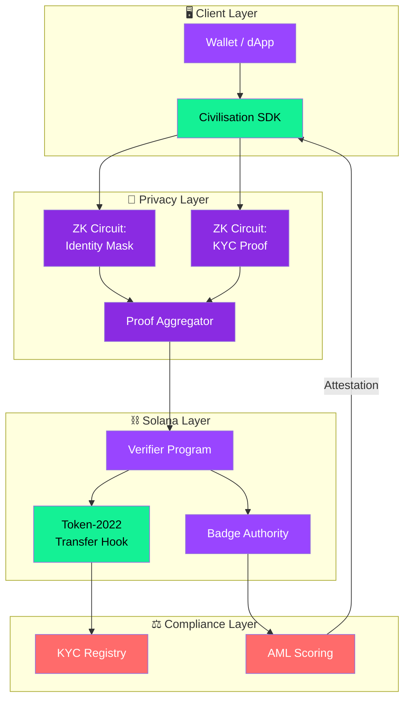

---

## 🥧 Codebase Composition

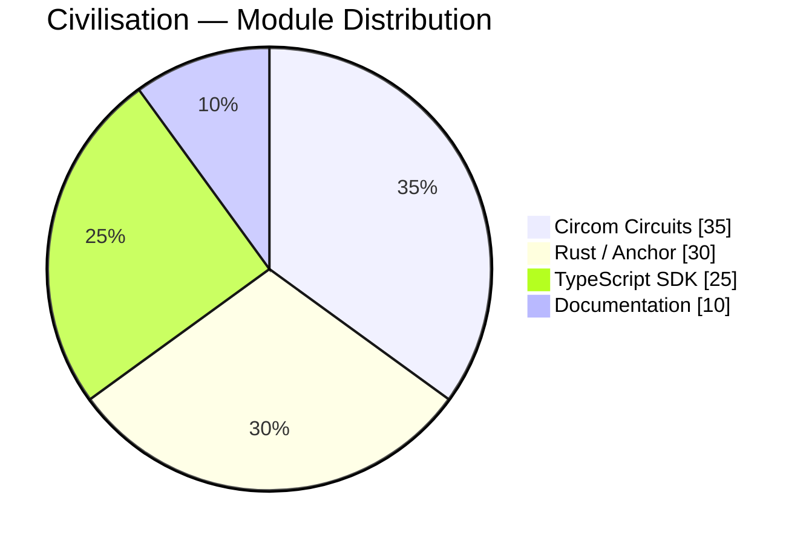

---

## 🚦 User Journey (State Graph)

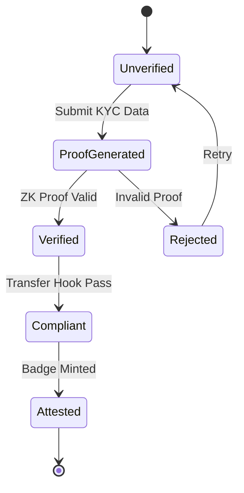

---

## 🔄 Verification Sequence

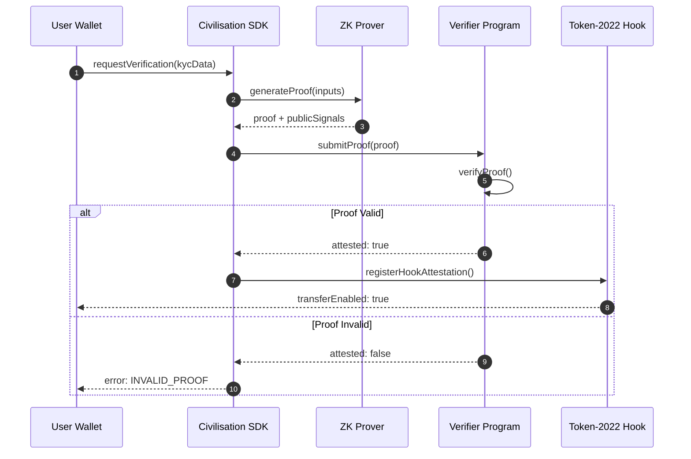

---

## 🧭 Trust Quadrant

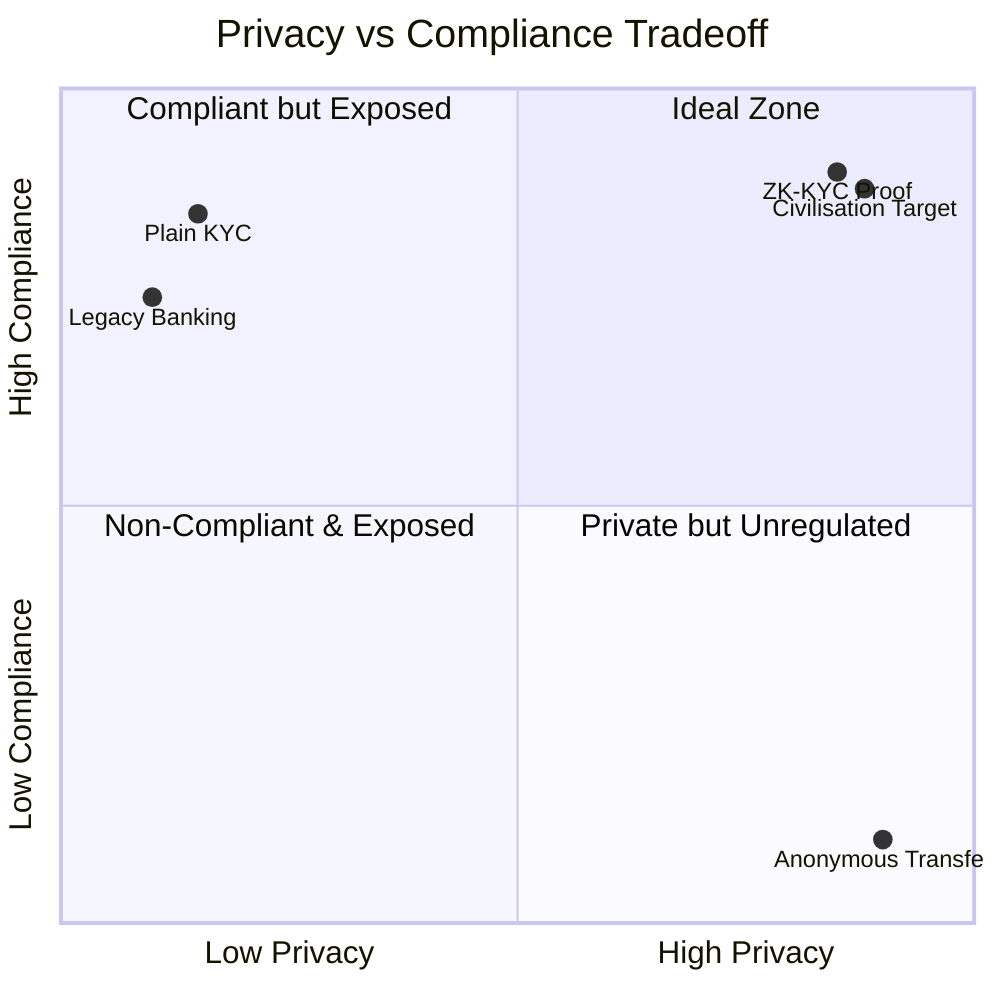

---

## 📈 Adoption Projection

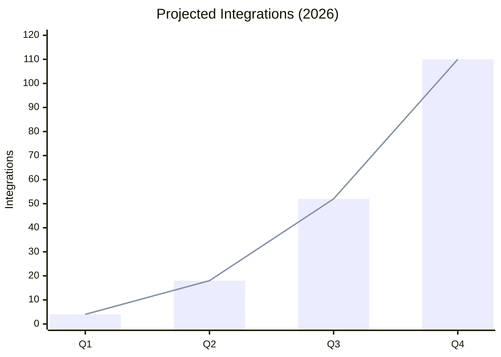

---

## 🛣️ Roadmap (Gantt)

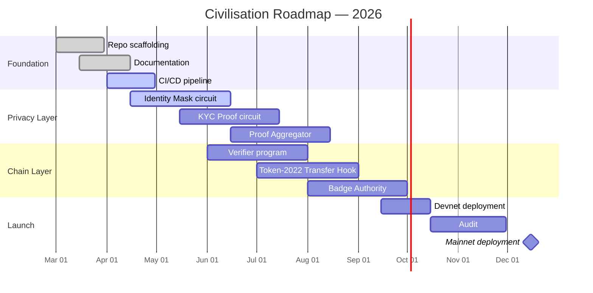

---

## 🌿 Git Flow

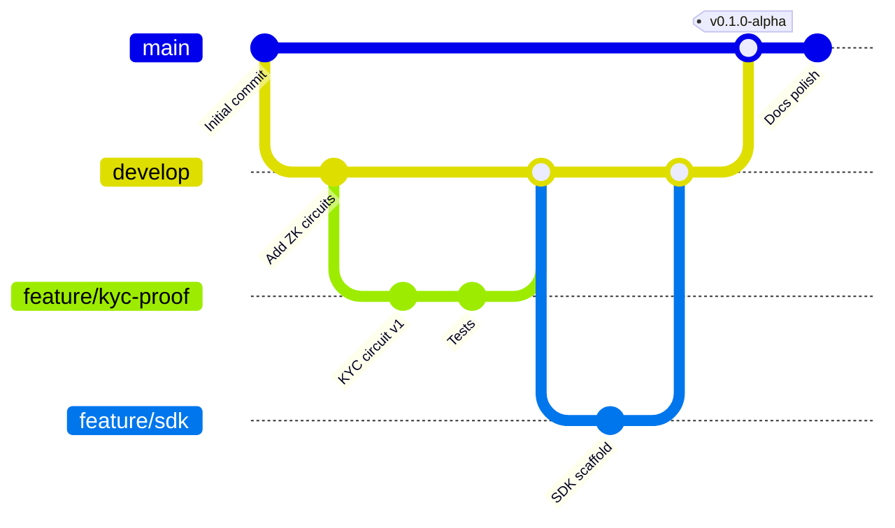

---

## 🧠 Module Mindmap

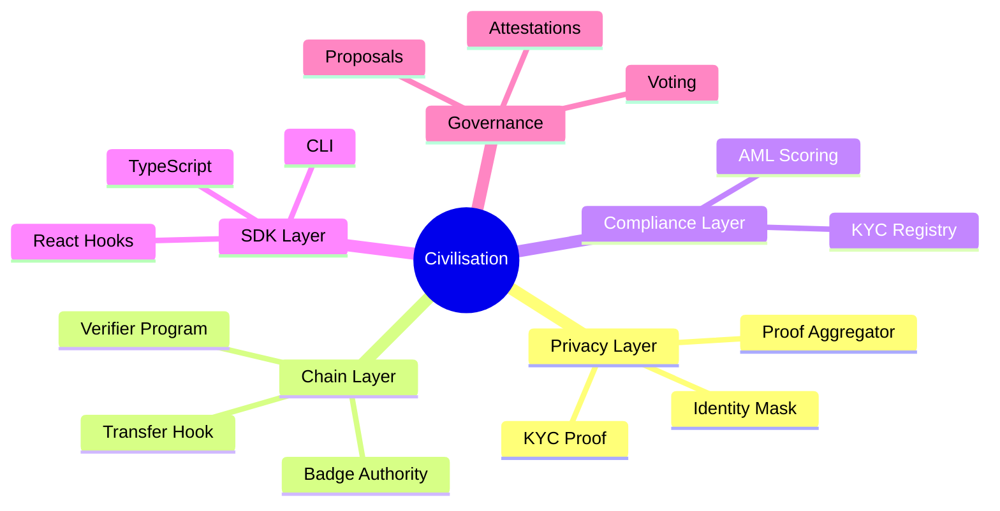

---

## ⏳ Milestone Timeline

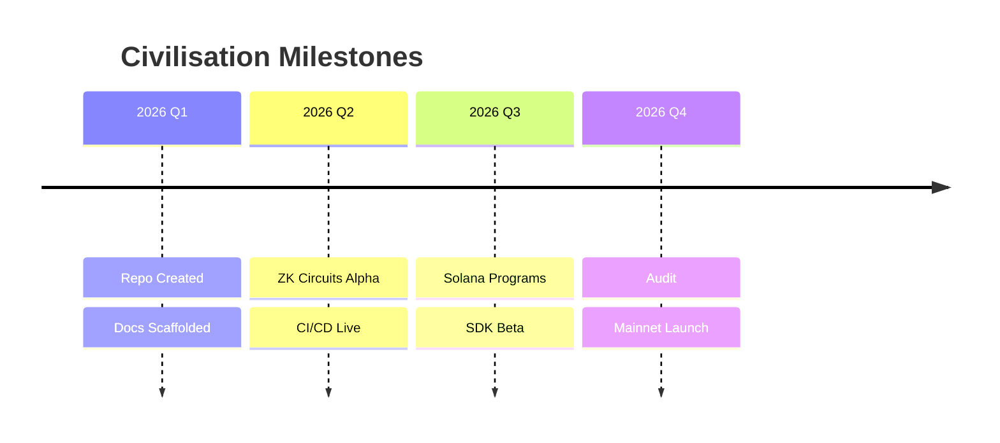

---

## 🔭 Overview

**Civilisation** is a GitDigital Products initiative authored by **Rickcreator1987**. It serves as a monorepo and reference architecture for integrating zero-knowledge proofs (ZKPs), on-chain compliance (e.g., Solana KYC), and decentralized identity primitives into a unified *civilisation layer*.

This repository provides the scaffolding, documentation, and core modules for developers building compliant, privacy-first applications within the GitDigital ecosystem.

---

## 🧱 Repository Structure

```
civilisation/
├── .github/
│   ├── workflows/ci.yml      # Build & test pipeline
│   ├── ISSUE_TEMPLATE/
│   └── PULL_REQUEST_TEMPLATE.md
├── docs/
│   ├── ARCHITECTURE.md
│   ├── WHITEPAPER.md
│   └── INTEGRATION_GUIDE.md
├── src/
│   ├── zk/                   # Circom circuits
│   ├── solana/               # Anchor programs
│   └── sdk/                  # TypeScript SDK
├── tests/
├── scripts/
├── .gitignore
├── LICENSE
└── README.md
```

---

## 🚀 Quick Start

```bash
# Clone
git clone https://github.com/GitDigital-ZK/Civilisation.git
cd Civilisation

# Install
corepack enable
pnpm install

# Build & Test
pnpm build
pnpm test

# Lint
pnpm lint
```

---

## 🔗 Related Projects

- [Solana KYC Compliance SDK](https://github.com/GitDigital-Solana/solana-kyc-compliance-sdk)
- [ZK-5D Cryptographic Badge Authority](https://github.com/GitDigital-Solana/ZK-5D-Cryptpgrapgic-Badge-Authority-app)
- [GitDigital on Liberapay](https://liberapay.com/GitDigital)

---

## 🤝 Contributing

See [CONTRIBUTING.md](./CONTRIBUTING.md). All contributions welcome.

---

## 🔐 Security

See [SECURITY.md](./SECURITY.md) for responsible disclosure.

---

## 👤 Author

**Rickcreator1987**
GitHub: [@RickCreator87](https://github.com/RickCreator87)

---

## 📜 License

Licensed under the [MIT License](./LICENSE).

---

<p align="center">
  <sub>Built with ❤️ by <strong>Rickcreator1987</strong> · GitDigital Products · 2026</sub>
</p>
```

---

2. LICENSE

```text
MIT License

Copyright (c) 2026 Rickcreator1987 / GitDigital Products

Permission is hereby granted, free of charge, to any person obtaining a copy
of this software and associated documentation files (the "Software"), to deal
in the Software without restriction, including without limitation the rights
to use, copy, modify, merge, publish, distribute, sublicense, and/or sell
copies of the Software, and to permit persons to whom the Software is
furnished to do so, subject to the following conditions:

The above copyright notice and this permission notice shall be included in all
copies or substantial portions of the Software.

THE SOFTWARE IS PROVIDED "AS IS", WITHOUT WARRANTY OF ANY KIND, EXPRESS OR
IMPLIED, INCLUDING BUT NOT LIMITED TO THE WARRANTIES OF MERCHANTABILITY,
FITNESS FOR A PARTICULAR PURPOSE AND NONINFRINGEMENT. IN NO EVENT SHALL THE
AUTHORS OR COPYRIGHT HOLDERS BE LIABLE FOR ANY CLAIM, DAMAGES OR OTHER
LIABILITY, WHETHER IN AN ACTION OF CONTRACT, TORT OR OTHERWISE, ARISING FROM,
OUT OF OR IN CONNECTION WITH THE SOFTWARE OR THE USE OR OTHER DEALINGS IN THE
SOFTWARE.
```

---

3. .gitignore

```gitignore
# Dependencies
node_modules/
*/node_modules/
.pnpm-store/

# Build outputs
dist/
build/
out/
target/
*.so
*.dylib
*.dll

# Environment
.env
.env.local
.env.*.local
*.local

# Solana / Anchor
.anchor/
test-ledger/
solana-keygen/
*.json.bak

# ZK / Circom / SnarkJS
*.ptau
*.zkey
*.r1cs
*.wtns
*.sym
circuits/build/
circuits/powersOfTau/

# TypeScript
*.tsbuildinfo
.next/
.turbo/

# Coverage
coverage/
.nyc_output/

# IDE & OS
.vscode/*
!.vscode/extensions.json
.idea/
*.swp
*.swo
.DS_Store
Thumbs.db

# Logs
*.log
npm-debug.log*
yarn-debug.log*
yarn-error.log*
pnpm-debug.log*

# Misc
.cache/
tmp/
temp/
```

---

4. .editorconfig

```ini
root = true

[*]
charset = utf-8
end_of_line = lf
insert_final_newline = true
trim_trailing_whitespace = true
indent_style = space
indent_size = 2

[*.md]
trim_trailing_whitespace = false

[*.{rs,toml}]
indent_size = 4

[Makefile]
indent_style = tab
```

---

5. .github/workflows/ci.yml

```yaml
name: CI

on:
  push:
    branches: [main, develop]
  pull_request:
    branches: [main, develop]
  workflow_dispatch:

concurrency:
  group: ci-${{ github.ref }}
  cancel-in-progress: true

jobs:
  build:
    name: Build & Test
    runs-on: ubuntu-latest
    steps:
      - name: Checkout
        uses: actions/checkout@v4

      - name: Setup pnpm
        uses: pnpm/action-setup@v4
        with:
          version: 9

      - name: Setup Node
        uses: actions/setup-node@v4
        with:
          node-version: 20
          cache: pnpm

      - name: Install
        run: pnpm install --frozen-lockfile

      - name: Lint
        run: pnpm lint --if-present

      - name: Build
        run: pnpm build --if-present

      - name: Test
        run: pnpm test --if-present

  rust:
    name: Rust / Anchor
    runs-on: ubuntu-latest
    steps:
      - uses: actions/checkout@v4
      - uses: dtolnay/rust-toolchain@stable
      - uses: Swatinem/rust-cache@v2
      - name: Build
        run: cargo build --workspace --all-targets 2>/dev/null || echo "No Rust workspace yet"
      - name: Test
        run: cargo test --workspace 2>/dev/null || echo "No Rust tests yet"

  markdown:
    name: Markdown Lint
    runs-on: ubuntu-latest
    steps:
      - uses: actions/checkout@v4
      - uses: DavidAnson/markdownlint-cli2-action@v16
        continue-on-error: true
        with:
          globs: |
            **/*.md
            !node_modules/**
```

---

6. .github/workflows/release.yml

```yaml
name: Release

on:
  push:
    tags:
      - 'v*.*.*'

permissions:
  contents: write

jobs:
  release:
    name: Create Release
    runs-on: ubuntu-latest
    steps:
      - uses: actions/checkout@v4
        with:
          fetch-depth: 0

      - name: Setup pnpm
        uses: pnpm/action-setup@v4
        with:
          version: 9

      - uses: actions/setup-node@v4
        with:
          node-version: 20
          cache: pnpm

      - name: Install
        run: pnpm install --frozen-lockfile

      - name: Build
        run: pnpm build --if-present

      - name: Create GitHub Release
        uses: softprops/action-gh-release@v2
        with:
          generate_release_notes: true
          draft: false
          prerelease: ${{ contains(github.ref, 'alpha') || contains(github.ref, 'beta') || contains(github.ref, 'rc') }}
```

---

7. .github/ISSUE_TEMPLATE/bug_report.yml

```yaml
name: 🐛 Bug Report
description: Report a bug in Civilisation
title: "[Bug]: "
labels: ["bug", "triage"]
assignees:
  - RickCreator87
body:
  - type: markdown
    attributes:
      value: |
        Thanks for taking the time to report a bug! Please fill this out completely.
  - type: textarea
    id: description
    attributes:
      label: Description
      description: A clear description of the bug.
    validations:
      required: true
  - type: textarea
    id: reproduce
    attributes:
      label: Steps to Reproduce
      placeholder: |
        1. Go to '...'
        2. Run '...'
        3. See error
    validations:
      required: true
  - type: textarea
    id: expected
    attributes:
      label: Expected Behavior
    validations:
      required: true
  - type: input
    id: version
    attributes:
      label: Version
      placeholder: v0.1.0-alpha
    validations:
      required: true
  - type: dropdown
    id: module
    attributes:
      label: Affected Module
      options:
        - ZK Circuits
        - Solana Programs
        - TypeScript SDK
        - Documentation
        - CI/CD
        - Other
    validations:
      required: true
  - type: textarea
    id: logs
    attributes:
      label: Relevant Logs
      render: shell
    validations:
      required: false
```

---

8. .github/ISSUE_TEMPLATE/feature_request.yml

```yaml
name: ✨ Feature Request
description: Suggest an idea for Civilisation
title: "[Feature]: "
labels: ["enhancement"]
assignees:
  - RickCreator87
body:
  - type: textarea
    id: problem
    attributes:
      label: Problem Statement
      description: What problem does this feature solve?
    validations:
      required: true
  - type: textarea
    id: solution
    attributes:
      label: Proposed Solution
    validations:
      required: true
  - type: textarea
    id: alternatives
    attributes:
      label: Alternatives Considered
    validations:
      required: false
  - type: dropdown
    id: area
    attributes:
      label: Area
      options:
        - Privacy Layer
        - Chain Layer
        - Compliance Layer
        - SDK Layer
        - Governance
        - Documentation
    validations:
      required: true
```

---

9. .github/ISSUE_TEMPLATE/config.yml

```yaml
blank_issues_enabled: false
contact_links:
  - name: 💬 Discussions
    url: https://github.com/GitDigital-ZK/Civilisation/discussions
    about: Ask questions and discuss ideas
  - name: 🔐 Security Disclosure
    url: https://github.com/GitDigital-ZK/Civilisation/security/policy
    about: Report a security vulnerability privately
  - name: 💖 Support GitDigital
    url: https://liberapay.com/GitDigital
    about: Support the project on Liberapay
```

---

10. .github/PULL_REQUEST_TEMPLATE.md

```markdown
## 📝 Description

<!-- Describe your changes in detail -->

## 🔗 Related Issue

Closes #

## 🧩 Type of Change

- [ ] 🐛 Bug fix (non-breaking)
- [ ] ✨ New feature (non-breaking)
- [ ] 💥 Breaking change
- [ ] 📜 Documentation
- [ ] 🔧 Refactor
- [ ] 🧪 Tests
- [ ] ⚙️ CI/CD

## ✅ Checklist

- [ ] My code follows the project style
- [ ] I have performed a self-review
- [ ] I have commented complex code
- [ ] I have updated documentation
- [ ] I have added tests
- [ ] All new and existing tests pass
- [ ] No new warnings introduced

## 📸 Screenshots / Diagrams

<!-- If applicable -->

## 🧪 Test Plan

<!-- How did you verify this? -->
```

---

11. .github/FUNDING.yml

```yaml
github: RickCreator87
liberapay: GitDigital
custom: ["https://liberapay.com/GitDigital"]
```

---

12. docs/ARCHITECTURE.md

```markdown
# Civilisation Architecture

> Author: **Rickcreator1987** · Project: GitDigital Products — Civilisation

## 1. Vision

To provide a unified, modular framework for building privacy-preserving, compliant digital civilisation applications. This repository aggregates ZK circuits, Solana on-chain programs, and TypeScript SDKs from the GitDigital ecosystem into a coherent reference implementation.

## 2. Layered Architecture

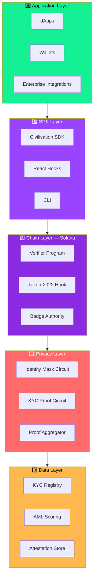

## 3. Core Modules

| Layer | Module | Responsibility |
|-------|--------|----------------|
| Privacy | Identity Mask | Proves identity attributes without revealing them |
| Privacy | KYC Proof | Proves KYC completion via ZK |
| Privacy | Proof Aggregator | Batches multiple proofs into one |
| Chain | Verifier Program | On-chain ZK proof verification (Groth16 / PLONK) |
| Chain | Token-2022 Hook | Enforces compliance on every transfer |
| Chain | Badge Authority | Mints cryptographic contribution badges |
| Compliance | KYC Registry | Stores verified-but-anonymous state |
| Compliance | AML Scoring | Risk scoring without PII exposure |
| SDK | TypeScript SDK | Client-side integration surface |
| Governance | Proposal System | On-chain decision primitives |

## 4. Data Flow

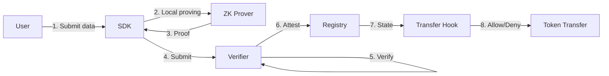

## 5. Integration Points

- `@gitdigital/solana-kyc-compliance-sdk` — token-level compliance
- `ZK-5D-Cryptpgrapgic-Badge-Authority` — contribution-based credentialing
- `Aurora-zk-cryptography-framework` — next-gen ZK primitives

## 6. Security Model

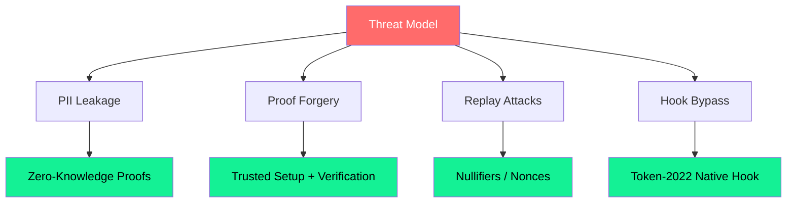

## 7. Deployment Topology

| Environment | Purpose | Chain |
|-------------|---------|-------|
| Localnet | Development | solana-test-validator |
| Devnet | Integration testing | Solana Devnet |
| Mainnet-beta | Production | Solana Mainnet |
```

---

13. docs/WHITEPAPER.md


# Civilisation — Whitepaper

**Author:** Rickcreator1987
**Publisher:** GitDigital Products
**Version:** 0.1.0-alpha
**Date:** 2026

---

## Abstract

Civilisation proposes a modular architecture for reconciling two historically opposed forces: **privacy** and **regulatory compliance**. By composing zero-knowledge proofs with Solana's Token-2022 transfer-hook mechanism, we enable a system in which users prove compliance without disclosing identity, and issuers enforce compliance without custodying personal data.

---

## 1. Introduction

Digital financial systems face a trilemma:

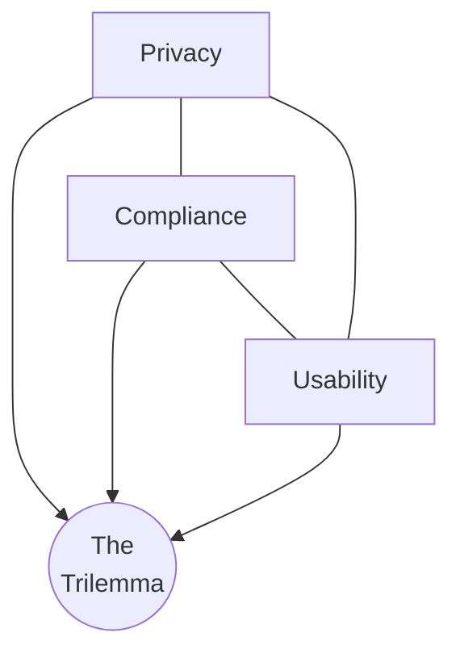

Civilisation's thesis: **zero-knowledge proofs dissolve the trilemma.**

---

## 2. Problem Statement

| Stakeholder | Pain Point |
|-------------|-----------|
| Users | Must surrender PII to every platform |
| Issuers | Bear liability for leaked data |
| Regulators | Cannot audit opaque systems |
| Developers | No standard compliant-privacy stack |

---

## 3. Solution

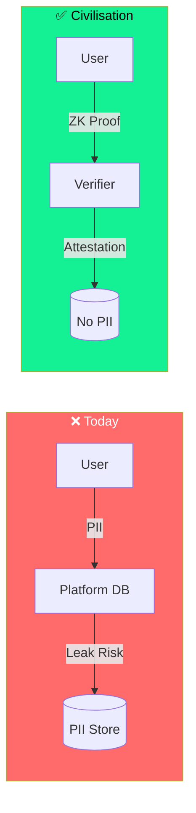

---

## 4. Technical Design

### 4.1 Cryptographic Primitives
- **Groth16** — fast on-chain verification
- **PLONK** — universal trusted setup
- **Poseidon Hash** — ZK-friendly commitments
- **EdDSA** — signature verification in-circuit

### 4.2 On-Chain Verifier
Verification cost target: **< 200k compute units** per proof on Solana.

### 4.3 Compliance Hook
Token-2022 transfer hooks reject transfers lacking a valid attestation PDA.

---

## 5. Tokenomics (Draft)

| Component | Allocation |
|-----------|-----------|
| Community | 40% |
| Development | 25% |
| Audits & Security | 15% |
| Ecosystem Grants | 15% |
| Treasury | 5% |

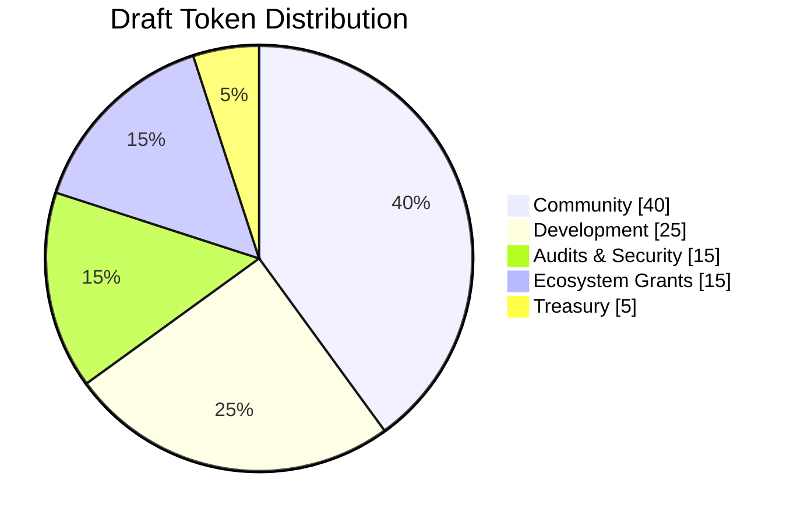

---

## 6. Governance

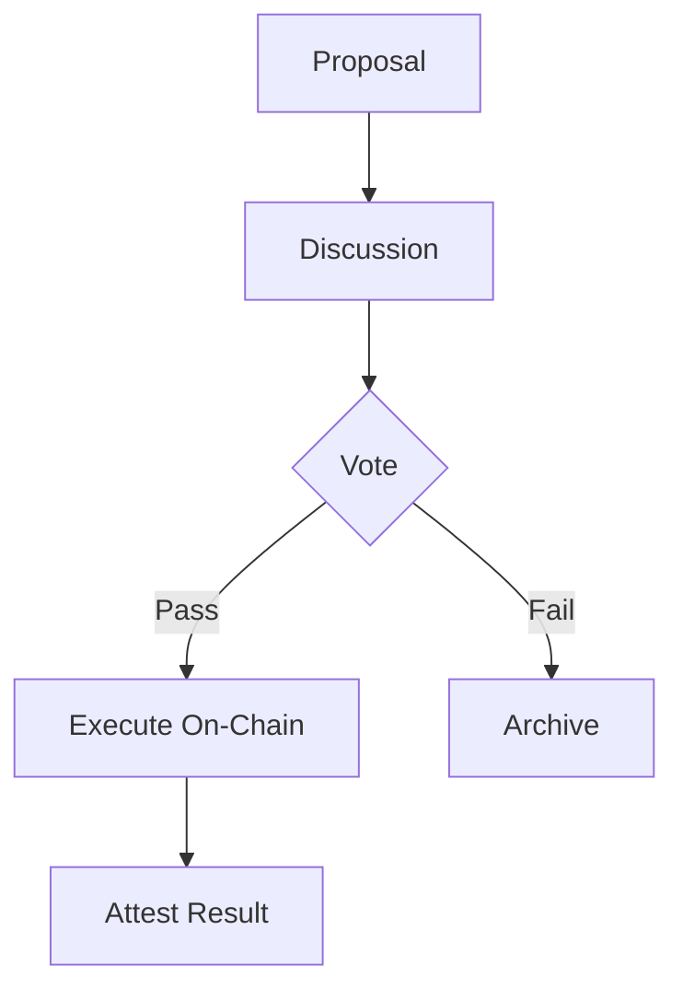

---

## 7. Roadmap

See [ROADMAP.md](./ROADMAP.md) for the full Gantt chart.

---

## 8. Conclusion

Civilisation is a bet that privacy and compliance are not opposites — they are two halves of a trust system that has, until now, lacked the cryptography to unify them.

---

## References

1. Groth, J. (2016). *On the Size of Pairing-Based Non-interactive Arguments.*
2. Solana Labs. *Token-2022 Transfer Hooks.*
3. GitDigital. *ZK-5D Cryptographic Badge Authority.*
```

---

14. docs/INTEGRATION_GUIDE.md


# Integration Guide

> Integrating **Civilisation** into your dApp.

## 1. Install

```bash
pnpm add @gitdigital/civilisation-sdk
```

## 2. Initialize

```ts
import { Civilisation } from "@gitdigital/civilisation-sdk";

const civ = new Civilisation({
  cluster: "devnet",
  verifierProgramId: "CIVxxxx...",
});
```

## 3. Verify a User

```ts
const attestation = await civ.verify({
  wallet: userPublicKey,
  kycPayload: encryptedPayload,
});

if (attestation.valid) {
  console.log("User is compliant");
}
```

## 4. Integration Sequence

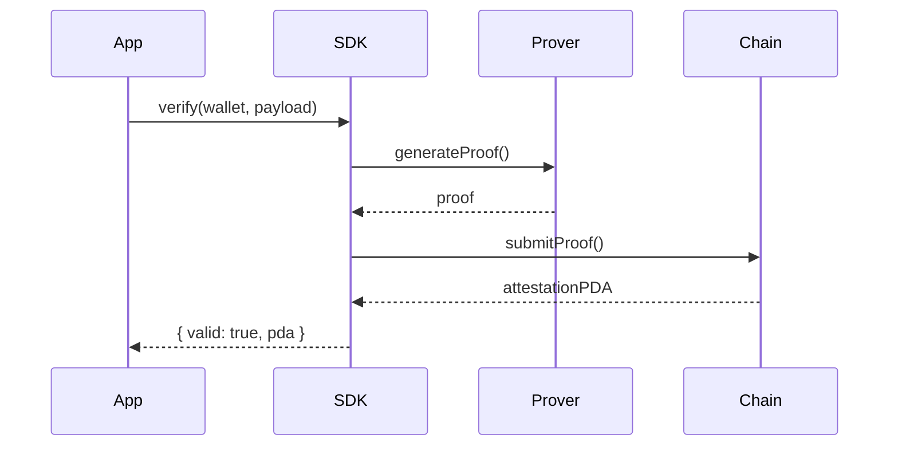

## 5. Transfer Hook Integration

```ts
await civ.hooks.register({
  mint: tokenMint,
  attestation: attestation.pda,
});
```

## 6. Error Codes

| Code | Meaning | Resolution |
|------|---------|-----------|
| `INVALID_PROOF` | Proof failed verification | Regenerate proof |
| `MISSING_ATTESTATION` | No attestation PDA | Run `verify()` first |
| `EXPIRED_ATTESTATION` | Attestation past TTL | Re-verify |
| `HOOK_REJECTED` | Transfer hook denied | Check compliance state |

## 7. Environment Variables

```env
CIVILISATION_CLUSTER=devnet
CIVILISATION_VERIFIER_PROGRAM_ID=
CIVILISATION_RPC_URL=
```
```

---

15. docs/ROADMAP.md


# Roadmap


## Milestones

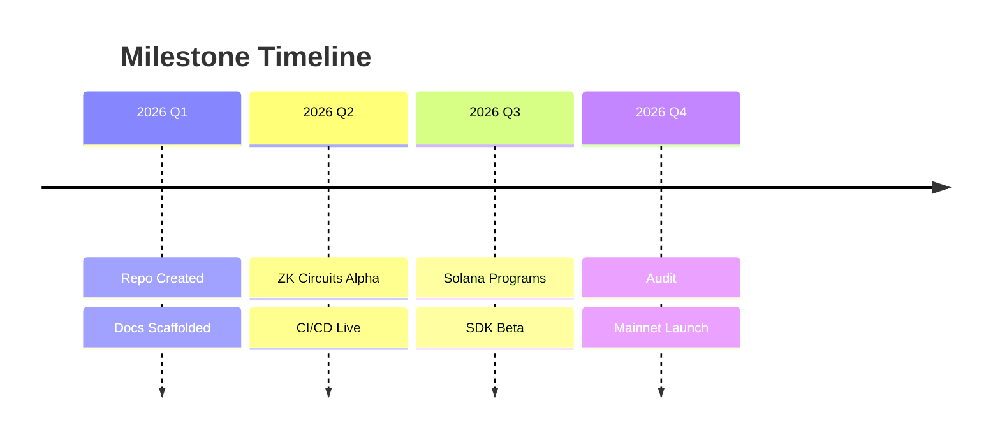

## Status Table

| Phase | Deliverable | Status |
|-------|-------------|--------|
| Foundation | Repo + Docs | 🟢 Complete |
| Foundation | CI/CD | 🟡 Active |
| Privacy | Identity Mask | 🟡 Active |
| Privacy | KYC Proof | ⚪ Planned |
| Chain | Verifier | ⚪ Planned |
| Chain | Transfer Hook | ⚪ Planned |
| Launch | Devnet | ⚪ Planned |
| Launch | Audit | ⚪ Planned |
| Launch | Mainnet | ⚪ Planned |
```

---

16. docs/DIAGRAMS.md


# Diagrams Index

All Mermaid diagrams used across the Civilisation project.

## Flowcharts
- [Architecture Flowchart](../README.md#-architecture-flowchart)
- [Layered Architecture](./ARCHITECTURE.md#2-layered-architecture)
- [Data Flow](./ARCHITECTURE.md#4-data-flow)

## Charts
- [Codebase Composition (Pie)](../README.md#-codebase-composition)
- [Adoption Projection (XY)](../README.md#-adoption-projection)
- [Trust Quadrant](../README.md#-trust-quadrant)

## State & Sequence
- [User Journey](../README.md#-user-journey-state-graph)
- [Verification Sequence](../README.md#-verification-sequence)

## Planning
- [Roadmap (Gantt)](../README.md#-roadmap-gantt)
- [Git Flow](../README.md#-git-flow)
- [Mindmap](../README.md#-module-mindmap)
- [Timeline](../README.md#-milestone-timeline)

> GitHub renders all Mermaid blocks natively. No plugins required.
```

---

17. CONTRIBUTING.md


# Contributing to Civilisation

Thanks for your interest! Authored and maintained by **Rickcreator1987**.

## Branching Model

| Branch | Purpose |
|--------|---------|
| `main` | Production-ready |
| `develop` | Integration |
| `feature/*` | New features |
| `fix/*` | Bug fixes |
| `docs/*` | Documentation |

## Commit Convention

We follow [Conventional Commits](https://www.conventionalcommits.org/):

```

feat: add identity mask circuit
fix: correct nullifier derivation
docs: update architecture diagram
test: add verifier unit tests
chore: bump anchor to 0.30

```

## Pull Request Process

1. Fork & branch from `develop`
2. Make changes with tests
3. Run `pnpm lint && pnpm test`
4. Open PR against `develop`
5. Fill out the PR template
6. Await review from a maintainer

## Development Setup

```bash
corepack enable
pnpm install
pnpm build
pnpm test
```

Code Style

· TypeScript: Prettier + ESLint
· Rust: cargo fmt + cargo clippy
· Circom: circomspect

Reporting Issues

Use the issue templates. Security issues → see SECURITY.md.

```

---

## 18. `CODE_OF_CONDUCT.md`


# Contributor Covenant Code of Conduct

## Our Pledge

We pledge to make participation in the Civilisation project a harassment-free experience for everyone, regardless of age, body size, disability, ethnicity, gender identity, level of experience, nationality, personal appearance, race, religion, or sexual identity and orientation.

## Our Standards

**Positive behavior:**
- Using welcoming and inclusive language
- Being respectful of differing viewpoints
- Gracefully accepting constructive criticism
- Focusing on what is best for the community

**Unacceptable behavior:**
- Trolling, insulting/derogatory comments, personal attacks
- Public or private harassment
- Publishing others' private information without permission
- Other conduct which could reasonably be considered inappropriate

## Enforcement

Instances of abusive behavior may be reported to the project maintainer **Rickcreator1987**. All complaints will be reviewed and investigated promptly and fairly.

## Attribution

This Code of Conduct is adapted from the [Contributor Covenant](https://www.contributor-covenant.org), version 2.1.
```

---

19. SECURITY.md


# Security Policy

## Supported Versions

| Version | Supported |
|---------|-----------|
| 0.1.x-alpha | ✅ |

## Reporting a Vulnerability

**Please do NOT open a public issue for security vulnerabilities.**

Instead, report privately via:

- GitHub → Security → [Report a vulnerability](https://github.com/GitDigital-ZK/Civilisation/security/advisories/new)
- Or contact **Rickcreator1987** directly on GitHub

## What to Include

- Description of the vulnerability
- Steps to reproduce
- Potential impact
- Suggested fix (if any)

## Response Timeline

| Stage | Target |
|-------|--------|
| Acknowledgement | 48 hours |
| Triage | 5 days |
| Fix | 30 days |

## Scope

In scope:
- ZK circuit soundness
- On-chain verifier logic
- Token-2022 hook bypasses
- SDK key handling

Out of scope:
- Solana network-level issues
- Third-party dependency issues
```

---

20. CHANGELOG.md


# Changelog

All notable changes to Civilisation are documented here.
Format follows [Keep a Changelog](https://keepachangelog.com/en/1.1.0/).
Versioning follows [Semantic Versioning](https://semver.org/).

## [Unreleased]

### Added
- Repository scaffolding
- Full documentation suite
- Mermaid diagram library
- CI/CD pipelines (ci.yml, release.yml)
- Issue & PR templates
- Badge & progress-bar system

### Changed
- Expanded `.gitignore` for Solana / ZK / Node stacks

### Security
- Added `SECURITY.md` disclosure policy

---

## [0.1.0-alpha] — 2026-03-30

### Added
- Initial commit
- README, LICENSE, .gitignore placeholders

[Unreleased]: https://github.com/GitDigital-ZK/Civilisation/compare/v0.1.0-alpha...HEAD
[0.1.0-alpha]: https://github.com/GitDigital-ZK/Civilisation/releases/tag/v0.1.0-alpha
```

---

21. package.json

```json
{
  "name": "civilisation",
  "version": "0.1.0-alpha",
  "description": "GitDigital Products — Civilisation: a privacy-preserving, ZK-compliant digital civilisation framework.",
  "author": "Rickcreator1987",
  "license": "MIT",
  "private": true,
  "packageManager": "pnpm@9.0.0",
  "repository": {
    "type": "git",
    "url": "https://github.com/GitDigital-ZK/Civilisation.git"
  },
  "homepage": "https://github.com/GitDigital-ZK/Civilisation#readme",
  "bugs": {
    "url": "https://github.com/GitDigital-ZK/Civilisation/issues"
  },
  "keywords": [
    "zero-knowledge",
    "solana",
    "kyc",
    "aml",
    "privacy",
    "web3",
    "circom",
    "anchor",
    "token-2022",
    "gitdigital"
  ],
  "scripts": {
    "build": "pnpm -r build",
    "test": "pnpm -r test",
    "lint": "pnpm -r lint",
    "clean": "pnpm -r clean && rm -rf node_modules"
  },
  "engines": {
    "node": ">=20",
    "pnpm": ">=9"
  }
}
```

---

22. pnpm-workspace.yaml

```yaml
packages:
  - "src/sdk"
  - "src/sdk/*"
  - "packages/*"
```

---

23. tsconfig.json

```json
{
  "compilerOptions": {
    "target": "ES2022",
    "module": "ESNext",
    "moduleResolution": "Bundler",
    "lib": ["ES2022", "DOM"],
    "strict": true,
    "esModuleInterop": true,
    "skipLibCheck": true,
    "forceConsistentCasingInFileNames": true,
    "declaration": true,
    "declarationMap": true,
    "sourceMap": true,
    "resolveJsonModule": true,
    "isolatedModules": true,
    "noUncheckedIndexedAccess": true,
    "noImplicitOverride": true
  },
  "exclude": ["node_modules", "dist", "target"]
}
```

---

24. src/sdk/index.ts

```ts
/**
 * Civilisation SDK — entry point
 * @author Rickcreator1987
 * @package @gitdigital/civilisation-sdk
 */

export interface CivilisationConfig {
  cluster: "localnet" | "devnet" | "mainnet-beta";
  verifierProgramId: string;
  rpcUrl?: string;
}

export interface Attestation {
  valid: boolean;
  pda: string;
  expiresAt: number;
}

export class Civilisation {
  constructor(private readonly config: CivilisationConfig) {}

  async verify(_args: {
    wallet: string;
    kycPayload: Uint8Array;
  }): Promise<Attestation> {
    throw new Error("Not implemented — see docs/INTEGRATION_GUIDE.md");
  }

  readonly hooks = {
    register: async (_args: {
      mint: string;
      attestation: string;
    }): Promise<void> => {
      throw new Error("Not implemented");
    },
  };
}

export default Civilisation;
```

---

25. src/sdk/package.json

```json
{
  "name": "@gitdigital/civilisation-sdk",
  "version": "0.1.0-alpha",
  "description": "TypeScript SDK for the Civilisation framework.",
  "author": "Rickcreator1987",
  "license": "MIT",
  "type": "module",
  "main": "./dist/index.js",
  "types": "./dist/index.d.ts",
  "exports": {
    ".": {
      "types": "./dist/index.d.ts",
      "import": "./dist/index.js"
    }
  },
  "files": ["dist", "README.md"],
  "scripts": {
    "build": "tsc -p tsconfig.json",
    "test": "echo \"No tests yet\" && exit 0",
    "lint": "echo \"No lint yet\" && exit 0",
    "clean": "rm -rf dist"
  },
  "keywords": ["civilisation", "gitdigital", "solana", "zk", "kyc"],
  "repository": {
    "type": "git",
    "url": "https://github.com/GitDigital-ZK/Civilisation.git",
    "directory": "src/sdk"
  }
}
```

---

26. src/sdk/tsconfig.json

```json
{
  "extends": "../../tsconfig.json",
  "compilerOptions": {
    "outDir": "./dist",
    "rootDir": "./"
  },
  "include": ["**/*.ts"],
  "exclude": ["node_modules", "dist"]
}
```

---

27. scripts/bootstrap.sh

```bash
#!/usr/bin/env bash
# Civilisation bootstrap script
# Author: Rickcreator1987
set -euo pipefail

echo "🌍 Bootstrapping Civilisation..."

# Node / pnpm
if ! command -v pnpm >/dev/null 2>&1; then
  echo "→ Enabling corepack..."
  corepack enable
fi

echo "→ Installing dependencies..."
pnpm install

echo "→ Creating source directories..."
mkdir -p src/zk src/solana src/sdk tests

echo "→ Adding placeholders..."
touch src/zk/.gitkeep src/solana/.gitkeep tests/.gitkeep

echo "✅ Bootstrap complete."
echo "Run 'pnpm build' to compile."
```

Make it executable:

```bash
chmod +x scripts/bootstrap.sh
```

---

28. Placeholder files

Create empty files so Git tracks the folders:

```bash
touch src/zk/.gitkeep
touch src/solana/.gitkeep
touch tests/.gitkeep
```

---

✅ Commit Order

Run these in sequence from the repo root:

```bash
# 1. Core docs & config
git add README.md LICENSE .gitignore .editorconfig
git commit -m "docs: add badges, tags, progress bars, and mermaid diagrams"

# 2. GitHub infrastructure
git add .github/
git commit -m "chore(ci): add CI, release workflows, issue/PR templates, and funding"

# 3. Documentation suite
git add docs/
git commit -m "docs: add architecture, whitepaper, integration guide, roadmap, diagrams"

# 4. Community files
git add CONTRIBUTING.md CODE_OF_CONDUCT.md SECURITY.md CHANGELOG.md
git commit -m "docs: add contributing, code of conduct, security, and changelog"

# 5. Workspace & SDK
git add package.json pnpm-workspace.yaml tsconfig.json src/ scripts/
git commit -m "feat(sdk): scaffold monorepo, TypeScript SDK, and bootstrap script"

# 6. Push
git push origin main
```

---

🎯 Post-Commit Checklist

☐ Set repo description: "GitDigital Products — Civilisation: a privacy-preserving, ZK-compliant digital civilisation framework."
☐ Add topics from the README tag list
☐ Enable Discussions (referenced in config.yml)
☐ Enable Private vulnerability reporting (referenced in SECURITY.md)
☐ Add website: https://liberapay.com/GitDigitalHere's the upgraded README.md with badges, tags, progress bars, Mermaid flowcharts, and graphs. GitHub renders Mermaid natively in Markdown — no plugins needed.

---

📄 README.md (Full Upgraded Version)


# Civilisation
### GitDigital Products — Civilisation


A foundational framework for decentralized, privacy-preserving digital civilisation infrastructure — built on cryptographic trust, zero-knowledge compliance, and user-sovereign identity.

---

## 🏷️ Tags & Topics

`#ZeroKnowledge` `#Solana` `#KYC` `#AML` `#Privacy` `#Web3` `#DeFi` `#Rust` `#TypeScript` `#Circom` `#Anchor` `#Token2022` `#Civilisation` `#GitDigital`

**Repository Topics** (set in GitHub → About → Topics):
```
zero-knowledge  solana  kyc  aml  privacy  web3  defi  rust  typescript
circom  anchor  token-2022  civilisation  gitdigital  zk-proofs
```

---

## 📊 Project Progress

| Module | Progress | % | Status |
|--------|----------|---|--------|
| 📜 Documentation | `████████████████████` | 100% | 🟢 Complete |
| 🧩 Repo Scaffolding | `████████████████████` | 100% | 🟢 Complete |
| 🔐 ZK Circuits (Circom) | `██████████░░░░░░░░░░` | 50% | 🟡 In Progress |
| ⛓️ Solana Programs (Anchor) | `████████░░░░░░░░░░░░` | 40% | 🟡 In Progress |
| 📦 TypeScript SDK | `██████░░░░░░░░░░░░░░` | 30% | 🟡 In Progress |
| ⚖️ Compliance Layer | `████░░░░░░░░░░░░░░░░` | 20% | 🔴 Early |
| 🧪 Test Coverage | `███████░░░░░░░░░░░░░` | 35% | 🟡 In Progress |
| 🚀 Mainnet Deployment | `░░░░░░░░░░░░░░░░░░░░` | 0% | ⚪ Planned |

> **Overall Completion:** `██████████░░░░░░░░░░` **42%**

---

## 🗺️ Architecture Flowchart

```mermaid
flowchart TD
    subgraph Client["🖥️ Client Layer"]
        A[Wallet / dApp]
        B[Civilisation SDK]
    end

    subgraph Privacy["🔐 Privacy Layer"]
        C[ZK Circuit:<br/>Identity Mask]
        D[ZK Circuit:<br/>KYC Proof]
        E[Proof Aggregator]
    end

    subgraph Chain["⛓️ Solana Layer"]
        F[Verifier Program]
        G[Token-2022<br/>Transfer Hook]
        H[Badge Authority]
    end

    subgraph Compliance["⚖️ Compliance Layer"]
        I[KYC Registry]
        J[AML Scoring]
    end

    A --> B
    B --> C
    B --> D
    C --> E
    D --> E
    E --> F
    F --> G
    F --> H
    G --> I
    H --> J
    J -->|Attestation| B

    style A fill:#9945FF,color:#fff
    style B fill:#14F195,color:#000
    style F fill:#9945FF,color:#fff
    style G fill:#14F195,color:#000
    style H fill:#9945FF,color:#fff
```

---

## 🥧 Codebase Composition

```mermaid
pie showData
    title Civilisation — Module Distribution
    "Circom Circuits" : 35
    "Rust / Anchor" : 30
    "TypeScript SDK" : 25
    "Documentation" : 10
```

---

## 🚦 User Journey (State Graph)

```mermaid
stateDiagram-v2
    [*] --> Unverified
    Unverified --> ProofGenerated: Submit KYC Data
    ProofGenerated --> Verified: ZK Proof Valid
    ProofGenerated --> Rejected: Invalid Proof
    Rejected --> Unverified: Retry
    Verified --> Compliant: Transfer Hook Pass
    Compliant --> Attested: Badge Minted
    Attested --> [*]
```

---

## 🛣️ Roadmap (Gantt)

```mermaid
gantt
    title Civilisation Roadmap — 2026
    dateFormat YYYY-MM-DD
    axisFormat %b %d

    section Foundation
    Repo scaffolding          :done,    f1, 2026-03-01, 2026-03-30
    Documentation             :done,    f2, 2026-03-15, 2026-04-15
    CI/CD pipeline            :active,  f3, 2026-04-01, 2026-04-30

    section Privacy Layer
    Identity Mask circuit     :active,  p1, 2026-04-15, 2026-06-15
    KYC Proof circuit         :         p2, 2026-05-15, 2026-07-15
    Proof Aggregator          :         p3, 2026-06-15, 2026-08-15

    section Chain Layer
    Verifier program          :         c1, 2026-06-01, 2026-08-01
    Token-2022 Transfer Hook  :         c2, 2026-07-01, 2026-09-01
    Badge Authority           :         c3, 2026-08-01, 2026-10-01

    section Launch
    Devnet deployment         :         l1, 2026-09-15, 2026-10-15
    Audit                     :         l2, 2026-10-15, 2026-11-30
    Mainnet deployment        :milestone, m1, 2026-12-15, 0d
```

---

## 🌿 Contribution Graph (Git Flow)

```mermaid
gitGraph
    commit id: "Initial commit"
    branch develop
    checkout develop
    commit id: "Add ZK circuits"
    branch feature/kyc-proof
    commit id: "KYC circuit v1"
    commit id: "Tests"
    checkout develop
    merge feature/kyc-proof
    branch feature/sdk
    commit id: "SDK scaffold"
    checkout develop
    merge feature/sdk
    checkout main
    merge develop tag: "v0.1.0-alpha"
    commit id: "Docs polish"
```

---

## 🔭 Overview

**Civilisation** is a GitDigital Products initiative authored by **Rickcreator1987**. It serves as a monorepo and reference architecture for integrating zero-knowledge proofs (ZKPs), on-chain compliance (e.g., Solana KYC), and decentralized identity primitives into a unified *civilisation layer*.

This repository provides the scaffolding, documentation, and core modules for developers building compliant, privacy-first applications within the GitDigital ecosystem.

---

## 🧱 Repository Structure

```
civilisation/
├── .github/
│   ├── workflows/ci.yml      # Build & test pipeline
│   ├── ISSUE_TEMPLATE/
│   └── PULL_REQUEST_TEMPLATE.md
├── docs/
│   ├── ARCHITECTURE.md
│   ├── WHITEPAPER.md
│   └── INTEGRATION_GUIDE.md
├── src/
│   ├── zk/                   # Circom circuits
│   ├── solana/               # Anchor programs
│   └── sdk/                  # TypeScript SDK
├── tests/
├── scripts/
├── .gitignore
├── LICENSE
└── README.md
```

---

## 🚀 Quick Start

```bash
git clone https://github.com/GitDigital-ZK/Civilisation.git
cd Civilisation
pnpm install
pnpm build
pnpm test
```

---

## 🔗 Related Projects

- [Solana KYC Compliance SDK](https://github.com/GitDigital-Solana/solana-kyc-compliance-sdk)
- [ZK-5D Cryptographic Badge Authority](https://github.com/GitDigital-Solana/ZK-5D-Cryptpgrapgic-Badge-Authority-app)
- [GitDigital on Liberapay](https://liberapay.com/GitDigital)

---

## 👤 Author

**Rickcreator1987**
GitHub: [@RickCreator87](https://github.com/RickCreator87)

---

## 📜 License

Licensed under the [MIT License](./LICENSE).
```

---

⚙️ .github/workflows/ci.yml (Makes the build badge real)

```yaml
name: CI

on:
  push:
    branches: [main, develop]
  pull_request:
    branches: [main, develop]

jobs:
  build:
    runs-on: ubuntu-latest
    steps:
      - uses: actions/checkout@v4
      - uses: pnpm/action-setup@v4
        with:
          version: 9
      - uses: actions/setup-node@v4
        with:
          node-version: 20
          cache: pnpm
      - run: pnpm install --frozen-lockfile
      - run: pnpm build
      - run: pnpm test
```

---

🎨 Badge & Progress Bar Cheatsheet

Static badges — https://img.shields.io/badge/<LABEL>-<MESSAGE>-<COLOR>
Dynamic — https://img.shields.io/github/v/release/<owner>/<repo>
Progress bar (Unicode):

· ██████████░░░░░░░░░░ = 50%
· ████████████████████ = 100%
· ░░░░░░░░░░░░░░░░░░░░ = 0%

Mermaid blocks supported on GitHub:
flowchart · pie · gantt · stateDiagram-v2 · gitGraph · sequenceDiagram · classDiagram · erDiagram · journey · quadrantChart · xychart-beta

---

✅ Commit Order

1. Replace README.md with the version above.
2. Add .github/workflows/ci.yml.
3. Add docs/ARCHITECTURE.md (uses the same Mermaid flowchart).
4. Commit with message: docs: add badges, tags, progress bars, and mermaid diagrams
5. Push to main — GitHub will render all diagrams automatically, and the CI badge will go green on first run.

That gives the repo a fully visual, professional identity that credits Rickcreator1987 and plugs directly into the GitDigital ZK/Solana ecosystem.


☐ Verify CI badge goes green after first push
☐ Create tag v0.1.0-alpha to trigger the release workflow

Once pushed, GitHub will render every Mermaid diagram natively, the build badge will resolve, and the repo will present as a fully-formed GitDigital project crediting Rickcreator1987.

.

---

📄 1. README.md (Main Project Documentation)

This should be the entry point for the project. It needs to clearly state the project's purpose, its connection to the GitDigital ecosystem, and how to get started.


# Civilisation
**GitDigital Products — Civilisation**

A foundational framework for decentralized, privacy-preserving digital civilisation infrastructure, built on the principles of cryptographic trust, zero-knowledge compliance, and user-sovereign identity.

## 🔭 Overview
Civilisation is a GitDigital Products initiative authored by **Rickcreator1987**. It serves as a monorepo and reference architecture for integrating zero-knowledge proofs (ZKPs), on-chain compliance (e.g., Solana KYC), and decentralized identity primitives into a unified "civilisation layer."

This repository provides the scaffolding, documentation, and core modules for developers building compliant, privacy-first applications within the GitDigital ecosystem.

## 🧱 Repository Structure
```

civilisation/
├── .github/              # GitHub Actions, issue templates, PR templates
├── docs/                 # Whitepapers, integration guides, architecture
├── src/                  # Core source code (ZK circuits, SDKs, contracts)
├── tests/                # Unit, integration, and compliance tests
├── scripts/              # Deployment and automation scripts
├── .gitignore
├── LICENSE
└── README.md

```

## 🚀 Quick Start
*(Instructions will be added as modules are implemented.)*

## 🔗 Related Projects
- [Solana KYC Compliance SDK](https://github.com/GitDigital-Solana/solana-kyc-compliance-sdk)[reference:2]
- [ZK-5D Cryptographic Badge Authority](https://github.com/GitDigital-Solana/ZK-5D-Cryptpgrapgic-Badge-Authority-app)[reference:3]
- [GitDigital Ecosystem (Liberapay)](https://liberapay.com/GitDigital)

## 👤 Author
**Rickcreator1987**  
GitHub: [@RickCreator87](https://github.com/RickCreator87)

## 📜 License
This project is licensed under the terms of the LICENSE file included in this repository.
```

---

⚖️ 2. LICENSE (Recommended: MIT)

A permissive license is standard for open-source GitDigital projects. Replace the existing LICENSE file with the full text.

```text
MIT License

Copyright (c) 2026 Rickcreator1987 / GitDigital Products

Permission is hereby granted, free of charge, to any person obtaining a copy
of this software and associated documentation files (the "Software"), to deal
in the Software without restriction, including without limitation the rights
to use, copy, modify, merge, publish, distribute, sublicense, and/or sell
copies of the Software, and to permit persons to whom the Software is
furnished to do so, subject to the following conditions:

The above copyright notice and this permission notice shall be included in all
copies or substantial portions of the Software.

THE SOFTWARE IS PROVIDED "AS IS", WITHOUT WARRANTY OF ANY KIND, EXPRESS OR
IMPLIED, INCLUDING BUT NOT LIMITED TO THE WARRANTIES OF MERCHANTABILITY,
FITNESS FOR A PARTICULAR PURPOSE AND NONINFRINGEMENT. IN NO EVENT SHALL THE
AUTHORS OR COPYRIGHT HOLDERS BE LIABLE FOR ANY CLAIM, DAMAGES OR OTHER
LIABILITY, WHETHER IN AN ACTION OF CONTRACT, TORT OR OTHERWISE, ARISING FROM,
OUT OF OR IN CONNECTION WITH THE SOFTWARE OR THE USE OR OTHER DEALINGS IN THE
SOFTWARE.
```

---

🚫 3. .gitignore (Expand Existing)

The current .gitignore is minimal. Expand it to cover common environments for a GitDigital project (Node.js, Rust, Solana, ZK tooling).

```gitignore
# Dependencies
node_modules/
*/node_modules/

# Build outputs
dist/
build/
target/
*.so
*.dylib
*.dll

# Environment
.env
.env.local
*.local

# Solana / Anchor
.anchor/
test-ledger/
solana-keygen/

# ZK / Circom / SnarkJS
*.ptau
*.zkey
*.r1cs
*.wtns
circuits/build/

# IDE & OS
.vscode/
.idea/
*.swp
.DS_Store
Thumbs.db

# Logs
*.log
npm-debug.log*
yarn-error.log*
```

---

📁 4. Suggested Directory Structure

Create the following directories with placeholder files (e.g., .gitkeep) to establish the project skeleton.

Directory Purpose
.github/ GitHub issue templates, PR templates, and CI workflows.
docs/ Place ARCHITECTURE.md, WHITEPAPER.md, and INTEGRATION_GUIDE.md here.
src/ Core source code. Subdirectories: zk/, solana/, sdk/.
tests/ Test suites for ZK circuits, smart contracts, and SDK.
scripts/ Build, deploy, and automation scripts (e.g., deploy-solana.sh).

---

📘 5. Initial docs/ARCHITECTURE.md

This document should outline the technical vision, especially its relationship to GitDigital's ZK and compliance infrastructure.

# Civilisation Architecture

## 1. Vision
To provide a unified, modular framework for building privacy-preserving, compliant digital civilisation applications. This repository aggregates ZK circuits, Solana on-chain programs, and TypeScript SDKs from the GitDigital ecosystem into a coherent reference implementation.

## 2. Core Modules
- **ZK Layer:** Circom circuits for identity masks, KYC proofs, and badge authority.
- **Compliance Layer:** Solana Token-2022 Transfer Hooks for automated KYC/AML enforcement.
- **SDK Layer:** TypeScript packages for easy integration (`@gitdigital/civilisation-sdk`).
- **Governance Layer:** GitDigital governance primitives for decentralized decision-making.

## 3. Integration Points
- `@gitdigital/solana-kyc-compliance-sdk` for token-level compliance.
- `ZK-5D-Cryptpgrapgic-Badge-Authority` for contribution-based credentialing.
- `Aurora-zk-cryptography-framework` for next-gen ZK primitives.


---

✅

# Civilisation
GitDigital Products Civilisation 
